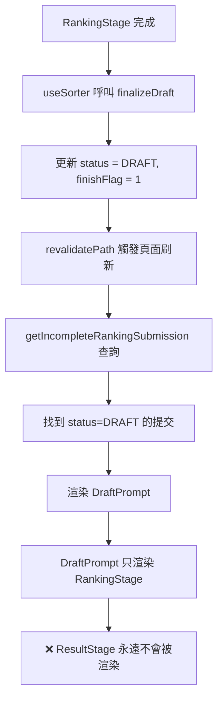
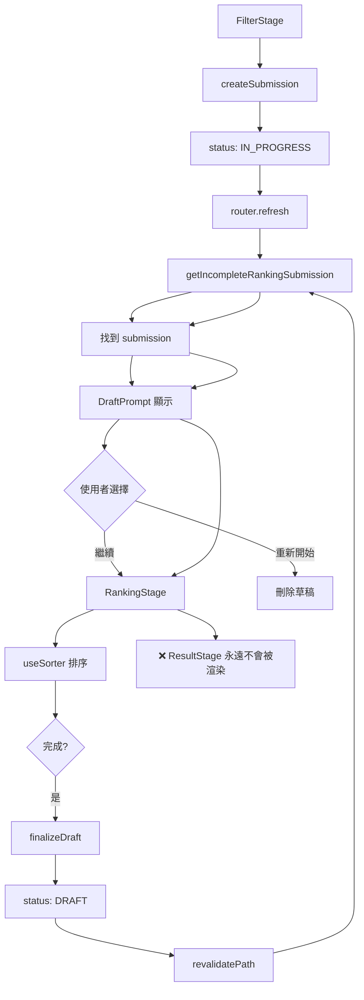
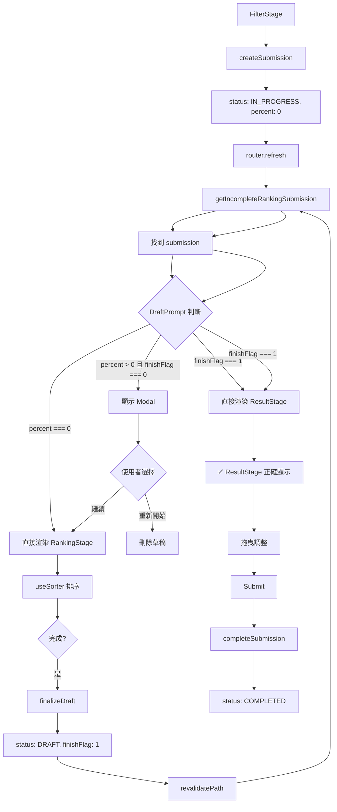

# Sorter 系統修復計畫

**建立時間**：2025-11-16  
**負責人**：Linus AI  
**預計工時**：1.5 小時

---

## 執行摘要

本計畫針對 Sorter 系統的核心問題提出修復方案：

1. ✅ **問題 1 + 問題 3**：DraftPrompt 狀態機重構（致命 + 體驗問題）
   - 整合「ResultStage 流程缺失」與「草稿提示時機不當」兩個問題
   - 一次性重構 DraftPrompt 為清晰的狀態機
2. ✅ **問題 2**：拖曳功能失效（嚴重）
3. ⚠️ **問題 4**：型別重構評估（暫不處理）

**優先順序**：問題 1+3 > 問題 2 > 問題 4

---

## 問題 1 + 問題 3：DraftPrompt 狀態機重構（整合修復）

> **注意**：此問題整合了原本的「問題 1：ResultStage 流程缺失」和「問題 3：草稿提示時機不當」，因為兩者都需要修改 DraftPrompt 的狀態判斷邏輯，應該一次性完成。

### 【問題診斷】

#### 問題 1：ResultStage 流程缺失（致命）

**當前流程（❌ 錯誤）**：



**根本原因**：
- `DraftPrompt` 沒有檢查 `draftState.finishFlag`
- 排序完成後（`finishFlag === 1`）仍然渲染 RankingStage
- 使用者無法進入 ResultStage 查看結果並拖曳調整

#### 問題 3：草稿提示時機不當（體驗問題）

**當前流程（❌ 不直觀）**：

```
FilterStage → 點擊「開始排序」
    → createSubmission（創建 status=IN_PROGRESS, percent=0 的草稿）
    → router.refresh()
    → getIncompleteRankingSubmission（找到剛創建的草稿）
    → DraftPrompt 顯示「你有未完成的排序，要繼續嗎？」
    → 使用者困惑：「我才剛按下開始，怎麼就有草稿了？」
```

**根本原因**：
- `createSubmission` 創建時使用 `status: IN_PROGRESS, percent: 0`
- `DraftPrompt` 對所有 `percent` 值都顯示 Modal
- 剛創建的草稿（`percent === 0`）被當作「未完成草稿」

#### DraftPrompt 的真實狀態空間

| finishFlag | percent | 實際意義 | **應該渲染什麼** | 當前渲染什麼 |
|------------|---------|---------|-----------------|-------------|
| 0 | 0 | 剛創建，尚未開始 | RankingStage（不顯示 Modal） | ❌ Modal |
| 0 | 1-99 | 進行中，有部分進度 | DraftPrompt Modal | ✅ Modal |
| 1 | 100 | 已完成，等待提交 | ResultStage | ❌ RankingStage |

**核心洞察**：這是一個**狀態機**，有 3 個互斥狀態，應該用清晰的條件判斷來處理。

#### 影響範圍

- **專輯 Sorter**：`src/app/sorter/album/[albumId]/page.tsx`
- **藝人 Sorter**：`src/app/sorter/artist/[artistId]/page.tsx`
- **兩者都受影響**

---

### 【修復方案】

#### 方案選擇：重構 DraftPrompt 為狀態機（推薦）

**做法**：
- 在 DraftPrompt 中加入清晰的狀態判斷邏輯
- 判斷順序（優先級）：
  1. `finishFlag === 1` → 渲染 ResultStage
  2. `percent === 0` → 渲染 RankingStage（不顯示 Modal）
  3. `0 < percent < 100` → 顯示 DraftPrompt Modal

**優點**：
- ✅ 改動最小（只需修改 1 個檔案）
- ✅ 邏輯清晰（狀態機，易於理解和測試）
- ✅ 一次性解決兩個問題
- ✅ 不需要新增路由或改變資料結構

**缺點**：
- ⚠️ DraftPrompt 的職責變得更複雜（需判斷多種狀態）
- ⚠️ 但這是合理的複雜度（符合元件的職責）

#### 替代方案：改變資料結構（不推薦）

**做法**：
- `createSubmission` 創建時使用 `status: DRAFT`
- FilterStage 提交後不 `router.refresh()`，直接客戶端渲染 RankingStage

**缺點**：
- ❌ 影響範圍大（需修改 server action + 頁面元件）
- ❌ 可能破壞其他依賴 `status` 的邏輯
- ❌ 不符合實用主義原則

---

### 【實作步驟】

#### 步驟 1：重構 DraftPrompt.tsx 為狀態機

**檔案**：`src/features/sorter/components/DraftPrompt.tsx`

**修改位置**：L27-86（整個函式主體）

**當前程式碼**：

```tsx
export function DraftPrompt({
    submissionId,
    draftState,
    draftDate,
    tracks,
    userId,
}: DraftPromptProps) {
    const [choice, setChoice] = useState<"continue" | "restart" | null>(null);
    const [isPending, startTransition] = useTransition();
    const router = useRouter();

    const handleRestart = () => {
        setChoice("restart");
        startTransition(async () => {
            await deleteSubmission({ submissionId });
            router.refresh();
        });
    };

    // 使用者尚未選擇 → 顯示 Modal
    if (choice === null) {
        return (
            <div className="fixed inset-0 z-50 flex items-center justify-center bg-black/50">
                {/* Modal 內容 */}
            </div>
        );
    }

    // 使用者選擇重新開始 → 顯示刪除中畫面
    if (choice === "restart") {
        return (
            <div className="flex items-center justify-center py-20">
                <p className="text-muted-foreground">正在刪除草稿...</p>
            </div>
        );
    }

    // 使用者選擇繼續 → 顯示 RankingStage
    return (
        <RankingStage
            initialState={draftState}
            tracks={tracks}
            submissionId={submissionId}
            userId={userId}
        />
    );
}
```

**修改後**：

```tsx
export function DraftPrompt({
    submissionId,
    draftState,
    draftDate,
    tracks,
    userId,
}: DraftPromptProps) {
    const [choice, setChoice] = useState<"continue" | "restart" | null>(null);
    const [isPending, startTransition] = useTransition();
    const router = useRouter();

    const handleRestart = () => {
        setChoice("restart");
        startTransition(async () => {
            await deleteSubmission({ submissionId });
            router.refresh();
        });
    };

    // ========================================
    // 狀態機：根據 draftState 決定渲染什麼
    // ========================================

    // 【狀態 1】排序已完成（finishFlag === 1，percent === 100）
    // → 直接顯示 ResultStage，讓使用者拖曳調整或提交
    if (draftState.finishFlag === 1) {
        return (
            <ResultStage
                draftState={draftState}
                tracks={tracks}
                userId={userId}
                submissionId={submissionId}
            />
        );
    }

    // 【狀態 2】剛創建的草稿（percent === 0）
    // → 使用者剛從 FilterStage 點擊「開始排序」，不應顯示 Modal
    if (draftState.percent === 0) {
        return (
            <RankingStage
                initialState={draftState}
                tracks={tracks}
                submissionId={submissionId}
                userId={userId}
            />
        );
    }

    // ========================================
    // 狀態 3：有進度但未完成（0 < percent < 100）
    // → 需要詢問使用者是否繼續
    // ========================================

    // 【狀態 3.1】使用者尚未選擇 → 顯示 Modal
    if (choice === null) {
        return (
            <div className="fixed inset-0 z-50 flex items-center justify-center bg-black/50">
                <div className="bg-background rounded-lg p-6 max-w-md w-full mx-4 space-y-4">
                    <h2 className="text-xl font-semibold">Unfinished Draft Found</h2>
                    <p className="text-muted-foreground">
                        You have an incomplete draft from {dateToDashFormat(draftDate)}
                        ({Math.round(draftState.percent)}% complete). Would you like to continue?
                    </p>
                    <div className="flex gap-3 justify-end">
                        <Button
                            variant="outline"
                            onClick={handleRestart}
                            disabled={isPending}
                        >
                            Start Over
                        </Button>
                        <Button
                            onClick={() => setChoice("continue")}
                            disabled={isPending}
                        >
                            Continue Draft
                        </Button>
                    </div>
                </div>
            </div>
        );
    }

    // 【狀態 3.2】使用者選擇重新開始 → 顯示刪除中畫面
    if (choice === "restart") {
        return (
            <div className="flex items-center justify-center py-20">
                <p className="text-muted-foreground">正在刪除草稿...</p>
            </div>
        );
    }

    // 【狀態 3.3】使用者選擇繼續 → 顯示 RankingStage
    return (
        <RankingStage
            initialState={draftState}
            tracks={tracks}
            submissionId={submissionId}
            userId={userId}
        />
    );
}
```

**說明**：
1. ✅ 優先判斷 `finishFlag === 1`（最高優先級）→ 問題 1 修復
2. ✅ 其次判斷 `percent === 0`（次高優先級）→ 問題 3 修復
3. ✅ 最後才處理 Modal 和使用者選擇（預設邏輯）
4. ✅ Modal 顯示進度百分比（體驗優化）
5. ✅ 清晰的註解說明每個狀態的語義

---

#### 步驟 2：加入 ResultStage import

**檔案**：`src/features/sorter/components/DraftPrompt.tsx`

**修改位置**：L1-10（頂部 imports）

**當前程式碼**：

```tsx
"use client";

import { useState, useTransition } from "react";
import { useRouter } from "next/navigation";
import { Button } from "@/components/ui/button";
import deleteSubmission from "../actions/deleteSubmission";
import { dateToDashFormat } from "@/lib/utils/date.utils";
import RankingStage from "./RankingStage";
import type { SorterStateType } from "@/lib/schemas/sorter";
import type { TrackData } from "@/types/data";
```

**修改後**：

```tsx
"use client";

import { useState, useTransition } from "react";
import { useRouter } from "next/navigation";
import { Button } from "@/components/ui/button";
import deleteSubmission from "../actions/deleteSubmission";
import { dateToDashFormat } from "@/lib/utils/date.utils";
import RankingStage from "./RankingStage";
import ResultStage from "./ResultStage";  // 【新增】
import type { SorterStateType } from "@/lib/schemas/sorter";
import type { TrackData } from "@/types/data";
```

---

### 【測試計畫】

#### 測試案例 1：新排序流程（問題 3 驗證）

1. 前往專輯/藝人頁面
2. 在 FilterStage 選擇歌曲/專輯
3. 點擊「開始排序」
4. **預期結果**：
   - ❌ **不顯示** DraftPrompt Modal
   - ✅ **直接進入** RankingStage
   - 流程順暢，無多餘步驟

#### 測試案例 2：專輯 Sorter 完整流程（問題 1 驗證）

1. 前往專輯頁面 `/sorter/album/[albumId]`
2. 在 FilterStage 選擇歌曲
3. 點擊「開始排序」
4. 在 RankingStage 完成所有比較
5. **預期結果**：
   - ✅ 自動進入 ResultStage，顯示排名結果
   - URL 不變，但畫面切換到結果頁面

#### 測試案例 3：藝人 Sorter 完整流程（問題 1 驗證）

1. 前往藝人頁面 `/sorter/artist/[artistId]`
2. 在 FilterStage 選擇專輯與歌曲
3. 點擊「開始排序」
4. 在 RankingStage 完成所有比較
5. **預期結果**：
   - ✅ 自動進入 ResultStage，顯示排名結果
   - URL 不變，但畫面切換到結果頁面

#### 測試案例 4：中途離開後恢復（有進度）

1. 在 RankingStage 完成 30% 的排序
2. 離開頁面（關閉分頁或導航到其他頁面）
3. 重新進入排序頁面
4. **預期結果**：
   - ✅ **顯示** DraftPrompt Modal
   - Modal 顯示「已完成 30%」
   - 使用者可選擇「繼續」或「重新開始」

#### 測試案例 5：已完成草稿的恢復

1. 在 RankingStage 完成排序並進入 ResultStage
2. 離開頁面（未提交）
3. 重新進入頁面
4. **預期結果**：
   - ❌ **不顯示** DraftPrompt Modal
   - ✅ **直接顯示** ResultStage

#### 測試案例 6：邊界條件（percent 接近 0）

1. 在 RankingStage 完成第一次比較（percent 約 5%）
2. 離開頁面
3. 重新進入
4. **預期結果**：
   - ✅ **顯示** DraftPrompt Modal（因為 `percent > 0`）
   - 使用者可選擇繼續或重新開始

---

### 【風險評估】

| 風險 | 影響 | 機率 | 緩解措施 |
|------|------|------|---------|
| ResultStage props 不匹配 | 高 | 低 | ResultStage 的 props 與 RankingStage 類似 |
| 狀態判斷順序錯誤 | 高 | 低 | 明確的註解和優先級說明 |
| draftState 資料不完整 | 中 | 低 | 測試案例 4, 5 驗證 |
| percent 計算不準確 | 低 | 低 | 測試案例 6 驗證邊界條件 |
| 現有草稿資料損毀 | 中 | 低 | CorruptedDraftFallback 已處理 |

---

## 問題 2：ResultStage 拖曳功能修復

### 【問題診斷】

#### 當前行為（❌ 錯誤）

1. 使用者拖曳歌曲項目
2. 拖曳過程中位置改變
3. 放開後，項目**回到原位**
4. 提交時可能送出錯誤的排名

#### 技術根源

**檔案**：`src/features/sorter/components/ResultStage.tsx`

**問題程式碼**（L64-67）：

```tsx
const [optimisticResult, setOptimisticResult] = useOptimistic(
    initialResult,
    (_, newResult: RankingResultData[]) => newResult
);
```

**問題分析**：

`useOptimistic` 是 React 19 引入的 hook，專為「樂觀更新」場景設計：

```tsx
// 正確用法：樂觀更新 + 非同步操作 + 自動回滾
const [optimisticData, setOptimisticData] = useOptimistic(serverData);

const handleUpdate = async () => {
    setOptimisticData(newData);  // 立即顯示
    await updateServer(newData);  // 背景同步
    // 如果失敗，自動回滾到 serverData
};
```

**為什麼不適合拖曳場景**：
- ResultStage 的拖曳是**純本地操作**，不需要伺服器同步
- 真正的提交在點擊 "Submit" 按鈕時才發生
- 使用 `useOptimistic` 增加了不必要的複雜度和認知負擔
- **不需要樂觀更新機制**，應該使用簡單的 `useState`

---

### 【修復方案】

#### 修復策略：useOptimistic → useState

**理由**：
- ✅ 拖曳是純本地操作，不需要伺服器同步
- ✅ `useState` 更簡潔，認知負擔更低
- ✅ 更符合語義，易於理解和維護

**效能考量**：
- 先完成功能修復
- 實際測試拖曳效能（歌曲數 10、20、30、50）
- 如有明顯 lag 再考慮優化（React.memo 或虛擬化）

---

### 【實作步驟】

#### 步驟 1：移除 useOptimistic 和 initialResult，改用 useState

**檔案**：`src/features/sorter/components/ResultStage.tsx`

**修改位置 1**：L63-67（移除 initialResult 和 useOptimistic）

**當前程式碼**：

```tsx
const [initialResult, setInitialResult] = useState<RankingResultData[]>([]);
const [optimisticResult, setOptimisticResult] = useOptimistic(
    initialResult,
    (_, newResult: RankingResultData[]) => newResult
);
```

**修改後**：

```tsx
const [result, setResult] = useState<RankingResultData[]>([]);
```

**說明**：同時移除 `initialResult` 和 `optimisticResult`，改用單一的 `result` state

---

**修改位置 2**：L71-88（初始化邏輯）

**當前程式碼**：

```tsx
useEffect(() => {
    const initializeResult = async () => {
        try {
            if (!draftState) {
                setIsLoading(false);
                return;
            }
            const finalResult = generateFinalResult(draftState, tracks);
            setInitialResult(finalResult);
            setIsLoading(false);
        } catch (error) {
            console.error("Failed to generate result:", error);
            setIsLoading(false);
        }
    };

    initializeResult();
}, [draftState, tracks]);
```

**修改後**：

```tsx
useEffect(() => {
    const initializeResult = async () => {
        try {
            if (!draftState) {
                setIsLoading(false);
                return;
            }
            const finalResult = generateFinalResult(draftState, tracks);
            setResult(finalResult);
            setIsLoading(false);
        } catch (error) {
            console.error("Failed to generate result:", error);
            setIsLoading(false);
        }
    };

    initializeResult();
}, [draftState, tracks]);
```

**說明**：將 `setInitialResult(finalResult)` 改為 `setResult(finalResult)`

---

**修改位置 3**：L108-138（拖曳處理）

**當前程式碼**：

```tsx
const handleDragEnd = (event: DragEndEvent) => {
    const { active, over } = event;

    if (!over || active.id === over.id) {
        return;
    }

    const oldIndex = optimisticResult.findIndex((item) => item.id === active.id);
    const newIndex = optimisticResult.findIndex((item) => item.id === over.id);

    if (oldIndex === -1 || newIndex === -1) {
        return;
    }

    // 重新排列數組
    const newResult = [...optimisticResult];
    const [movedItem] = newResult.splice(oldIndex, 1);
    newResult.splice(newIndex, 0, movedItem);

    // 更新排名
    const updatedResult = newResult.map((item, index) => ({
        ...item,
        ranking: index + 1,
    }));

    // 樂觀更新
    startTransition(() => {
        setOptimisticResult(updatedResult);
    });
};
```

**修改後**：

```tsx
const handleDragEnd = (event: DragEndEvent) => {
    const { active, over } = event;

    if (!over || active.id === over.id) {
        return;
    }

    const oldIndex = result.findIndex((item) => item.id === active.id);
    const newIndex = result.findIndex((item) => item.id === over.id);

    if (oldIndex === -1 || newIndex === -1) {
        return;
    }

    // 重新排列數組
    const newResult = [...result];
    const [movedItem] = newResult.splice(oldIndex, 1);
    newResult.splice(newIndex, 0, movedItem);

    // 更新排名
    const updatedResult = newResult.map((item, index) => ({
        ...item,
        ranking: index + 1,
    }));

    // 直接更新狀態
    setResult(updatedResult);
};
```

**說明**：
- 所有 `optimisticResult` 改為 `result`
- 移除 `startTransition`（拖曳是高優先級更新）
- 直接用 `setResult` 更新狀態

---

**修改位置 4**：L141-144（提交處理）

**當前程式碼**：

```tsx
const handleSubmit = () => {
    completeSubmission({ trackRankings: optimisticResult, submissionId });
    //TODO: 導向正確路由
};
```

**修改後**：

```tsx
const handleSubmit = () => {
    completeSubmission({ trackRankings: result, submissionId });
    //TODO: 導向正確路由
};
```

**說明**：將 `optimisticResult` 改為 `result`

---

**修改位置 5**：L184-194（渲染邏輯）

**當前程式碼**：

```tsx
<SortableContext
    items={optimisticResult.map((item) => item.id)}
    strategy={verticalListSortingStrategy}
>
    <div>
        {optimisticResult.map((data, index) => (
            <SortableResultItem
                key={data.id}
                data={data}
                ranking={index + 1}
            />
        ))}
    </div>
</SortableContext>
```

**修改後**：

```tsx
<SortableContext
    items={result.map((item) => item.id)}
    strategy={verticalListSortingStrategy}
>
    <div>
        {result.map((data) => (
            <SortableResultItem
                key={data.id}
                data={data}
                ranking={data.ranking}
            />
        ))}
    </div>
</SortableContext>
```

**說明**：
- 所有 `optimisticResult` 改為 `result`
- `ranking={index + 1}` 改為 `ranking={data.ranking}`（使用 data 中已計算好的 ranking）

---

#### 步驟 2：更新 import 語句

**檔案**：`src/features/sorter/components/ResultStage.tsx`

**修改位置**：L4-9（頂部 imports）

**當前程式碼**：

```tsx
import React, {
	startTransition,
	useEffect,
	useOptimistic,
	useState,
} from "react";
```

**修改後**：

```tsx
import React, {
	useEffect,
	useState,
} from "react";
```

**說明**：移除 `startTransition` 和 `useOptimistic`，保留 `useState` 和 `useEffect`

---

### 【測試計畫】

#### 測試案例 1：基本拖曳功能

1. 完成 RankingStage，進入 ResultStage
2. 拖曳第 3 首歌到第 1 位
3. **預期結果**：
   - 拖曳過程中位置改變
   - 放開後**保持在新位置**
   - 排名數字自動更新（1, 2, 3...）

#### 測試案例 2：多次拖曳

1. 在 ResultStage 中
2. 執行以下操作：
   - 拖曳 A 到第 1 位
   - 拖曳 B 到第 2 位
   - 拖曳 C 到第 3 位
3. **預期結果**：
   - 每次拖曳後位置都正確保存
   - 排名數字持續更新

#### 測試案例 3：拖曳後提交

1. 在 ResultStage 中拖曳調整排名
2. 點擊「Submit」按鈕
3. **預期結果**：
   - 提交成功
   - 資料庫中的排名與拖曳後的順序一致
4. **驗證方式**：
   - 檢查 `TrackRanking` 表的 `ranking` 欄位
   - 或在個人排名頁面查看結果

#### 測試案例 4：邊界測試

1. 拖曳第一首歌到最後
2. 拖曳最後一首歌到第一
3. 拖曳中間的歌到中間的其他位置
4. **預期結果**：所有情況都能正確更新排名

---

### 【效能測試建議】

修復完成後，建議進行實際效能測試：

1. **測試不同歌曲數量**：10、20、30、50 首
2. **觀察拖曳流暢度**：是否有明顯卡頓或延遲
3. **使用 Chrome DevTools Performance** 錄製拖曳過程

**如果發現效能問題**，可考慮以下優化：
- React.memo（需要 custom comparator）
- 虛擬化列表（`@tanstack/react-virtual`）
- 優化圖片載入（lazy loading）

---

### 【風險評估】

| 風險 | 影響 | 機率 | 緩解措施 |
|------|------|------|---------|
| 拖曳後仍回到原位 | 高 | 低 | 測試案例 1, 2 詳細驗證 |
| 提交資料不一致 | 高 | 低 | 測試案例 3 驗證資料庫 |
| TypeScript 型別錯誤 | 中 | 低 | 執行 `npx tsc --noEmit` 檢查 |

---

## 問題 4：型別重構評估

> **注意**：問題 3（草稿提示時機優化）已整合至「問題 1 + 問題 3」，此處為問題 4。

### 【問題診斷】

#### 當前狀況

**型別定義**（`src/features/sorter/types.ts`）：

```tsx
export type RankingResultData = TrackData & {
    ranking: number;
};
```

**使用場景**：

1. **ResultStage.tsx**：
   - 用於拖曳列表的 data type
   - **需要的欄位**：`id`, `name`, `img`, `album.name`, `ranking`（完整的 TrackData）

2. **convertResult.ts**：
   - `generateFinalResult` 回傳型別
   - `convertResultToDraftState` 參數型別
   - **需要的欄位**：`result.name` 用於查找 index

3. **completeSubmission.ts**：
   - `trackRankings` 參數型別
   - **需要的欄位**：完整的 TrackData（用於建立 `TrackRanking` 資料）

4. **calculateAlbumPoints.ts**（sorter 版本）：
   - **需要的欄位**：`albumId`, `ranking`（只需要這兩個）

#### 新舊版本差異

| 檔案 | 參數型別 | 實際使用欄位 |
|------|---------|------------|
| `features/sorter/utils/calculateAlbumPoints.ts` | `RankingResultData[]` | `albumId`, `ranking` |
| `features/ranking/utils/calculateAlbumPoints.ts` | `{albumId: string \| null, rank: number}[]` | `albumId`, `rank` |

**問題**：
- Sorter 版本接收完整的 `RankingResultData`，但只用到 2 個欄位
- Ranking 版本使用更精簡的型別

---

### 【評估結論】

#### ❌ 不建議移除 RankingResultData

**理由**：

1. **大部分場景需要完整資料**：
   - ResultStage 需要顯示 UI（封面、專輯名稱等）
   - completeSubmission 需要建立完整的 TrackRanking 資料
   - convertResultToDraftState 需要 `result.name` 來查找 index

2. **只有一個函式用不到**：
   - 只有 `calculateAlbumPoints` 用不到完整的 TrackData
   - 為了一個函式重構整個型別系統，**不符合實用主義原則**

3. **改動成本 > 收益**：
   - 需要修改 4-5 個檔案
   - 可能引入新的 bug
   - 型別安全性降低（需要手動 mapping）

#### ✅ 可選優化：調整 calculateAlbumPoints 簽名

**做法**：只改 `calculateAlbumPoints` 的簽名，在呼叫處做 mapping

**修改範圍**：
- `src/features/sorter/utils/calculateAlbumPoints.ts`（函式簽名）
- `src/features/sorter/actions/completeSubmission.ts`（呼叫處）

**優點**：
- ✅ 改動最小（只需修改 2 個位置）
- ✅ 函式簽名更精確（只接收需要的欄位）
- ✅ 不影響其他使用 `RankingResultData` 的地方

**缺點**：
- ⚠️ 需要在呼叫處做 mapping（增加一行程式碼）

---

### 【可選實作步驟】

#### 步驟 1：修改 calculateAlbumPoints 簽名

**檔案**：`src/features/sorter/utils/calculateAlbumPoints.ts`

**修改位置**：L18-22（函式簽名）

**當前程式碼**：

```tsx
export function calculateAlbumPoints(
    trackRankings: RankingResultData[],
    albumId: string
): number {
    // ...
}
```

**修改後**：

```tsx
export function calculateAlbumPoints(
    trackRankings: Array<{ albumId: string | null; ranking: number }>,
    albumId: string
): number {
    // ...
}
```

**說明**：
- 移除對 `RankingResultData` 的依賴
- 使用 inline type，只包含需要的欄位

---

#### 步驟 2：更新 completeSubmission 的呼叫

**檔案**：`src/features/sorter/actions/completeSubmission.ts`

**修改位置**：L94-99（calculateAlbumPoints 呼叫處）

**當前程式碼**：

```tsx
const albumStats = new Map<string, { totalPoints: number; count: number }>();

for (const track of trackRankings) {
    if (!track.albumId) continue;

    const points = calculateAlbumPoints(trackRankings, track.albumId);
    // ...
}
```

**修改後**：

```tsx
const albumStats = new Map<string, { totalPoints: number; count: number }>();

// 將 trackRankings 轉換為 calculateAlbumPoints 需要的格式
const rankingsForCalc = trackRankings.map(t => ({
    albumId: t.albumId,
    ranking: t.ranking,
}));

for (const track of trackRankings) {
    if (!track.albumId) continue;

    const points = calculateAlbumPoints(rankingsForCalc, track.albumId);
    // ...
}
```

**說明**：
- 在迴圈外部做一次 mapping
- 避免在迴圈內重複 mapping（效能考量）

---

#### 步驟 3：移除不必要的 import

**檔案**：`src/features/sorter/utils/calculateAlbumPoints.ts`

**檢查 import**：

```tsx
import type { RankingResultData } from "../types"; // ❌ 可能不再需要
```

**如果函式簽名已改為 inline type**：

```tsx
// 移除 import（如果檔案中沒有其他地方使用 RankingResultData）
```

---

### 【決策建議】

#### 🟢 建議：暫不處理

**理由**：

1. **優先級低**：
   - 問題 1, 2, 3 是功能性缺陷，影響使用者體驗
   - 問題 4 是程式碼品質優化，不影響功能

2. **收益有限**：
   - 只優化一個函式的簽名
   - 不會提升效能或可維護性

3. **技術債不嚴重**：
   - `RankingResultData` 的定義清晰
   - 沒有過度耦合或循環依賴

#### 🟡 可選：納入後續重構

**時機**：
- 當需要大規模重構 Sorter 模組時
- 當 `calculateAlbumPoints` 邏輯需要重大修改時
- 當引入新的計分系統時

**建議做法**：
- 統一 Sorter 和 Ranking 兩個版本的 `calculateAlbumPoints`
- 移至共用的 `src/lib/utils/` 資料夾
- 使用更通用的型別定義

---

### 【風險評估】

| 風險 | 影響 | 機率 | 緩解措施 |
|------|------|------|---------|
| 型別不匹配 | 中 | 低 | TypeScript 編譯時檢查 |
| mapping 效能問題 | 低 | 低 | 在迴圈外部做一次 mapping |
| 其他地方仍使用舊型別 | 低 | 低 | 搜尋所有 `calculateAlbumPoints` 呼叫處 |

---

## 整體修復計畫

### 【修復順序】

#### Phase 1：核心功能修復（必做）

1. **問題 1 + 問題 3（整合）**：DraftPrompt 狀態機重構（30 分鐘）
   - 一次性重構 `DraftPrompt.tsx` 為清晰的狀態機
   - 優先判斷 `finishFlag === 1` → 渲染 ResultStage
   - 其次判斷 `percent === 0` → 渲染 RankingStage（不顯示 Modal）
   - 最後處理 Modal 和使用者選擇邏輯
   - 加入 `import ResultStage from "./ResultStage"`

2. **問題 2**：拖曳功能修復（30 分鐘）
   - 移除 `useOptimistic` 和 `initialResult`
   - 改用 `useState`
   - 更新所有引用位置

#### Phase 2：測試驗證（必做）

3. **整合測試**（20-30 分鐘）
   - 測試完整流程（FilterStage → RankingStage → ResultStage → Submit）
   - 測試拖曳功能
   - 測試草稿恢復（三種情境：percent=0, 0<percent<100, finishFlag=1）

4. **效能測試**（可選，10-15 分鐘）
   - 測試不同歌曲數量的拖曳效能
   - 決定是否需要優化

#### Phase 3：程式碼品質（可選）

5. **問題 4**：型別重構評估（暫不處理）
   - 納入後續重構計畫

---

### 【預計工時】

| 階段 | 任務 | 預計時間 | 測試時間 | 總計 |
|------|------|---------|---------|------|
| Phase 1 | 問題 1+3 + 問題 2 | 60 分鐘 | - | 60 分鐘 |
| Phase 2 | 整合測試 + 效能測試 | - | 30-45 分鐘 | 30-45 分鐘 |
| **總計** | | **60 分鐘** | **30-45 分鐘** | **90-105 分鐘** |

**預計總工時**：約 **1.5-2 小時**

---

### 【檔案修改清單】

#### 需要修改的檔案

1. `src/features/sorter/components/DraftPrompt.tsx`
   - **問題 1 + 問題 3 整合修復**：
     - 重構為狀態機（5 個互斥狀態）
     - 優先判斷 `finishFlag === 1` → 渲染 ResultStage
     - 其次判斷 `percent === 0` → 直接渲染 RankingStage
     - 最後處理 Modal（有進度時）
     - Modal 文案加入進度百分比顯示
   - 加入 `import ResultStage from "./ResultStage"`

2. `src/features/sorter/components/ResultStage.tsx`
   - **問題 2**：移除 `useOptimistic`, `initialResult`, `startTransition`
   - **問題 2**：改用單一 `result` state (useState)
   - **問題 2**：更新所有引用 (handleDragEnd, handleSubmit, 渲染邏輯)
   - **問題 2**：更新 import（移除 useOptimistic 和 startTransition）

#### 不需修改的檔案

- ✅ `src/app/sorter/album/[albumId]/page.tsx`（頁面邏輯不變）
- ✅ `src/app/sorter/artist/[artistId]/page.tsx`（頁面邏輯不變）
- ✅ `src/features/sorter/hooks/useSorter.ts`（排序邏輯不變）
- ✅ `src/features/sorter/actions/finalizeDraft.ts`（Server action 不變）
- ✅ `src/features/sorter/types.ts`（型別定義不變）

---

### 【測試策略】

#### 單元測試（可選）

- `convertResult.ts` 的 `generateFinalResult`
- `calculateAlbumPoints` 的計分邏輯

#### 整合測試（必做）

1. **完整流程測試**：
   - FilterStage → RankingStage → ResultStage → Submit
   - 驗證資料正確寫入資料庫

2. **草稿恢復測試**：
   - 中途離開 → 重新進入 → 繼續排序 → 完成
   - 驗證進度正確保存與恢復

3. **拖曳功能測試**：
   - 多次拖曳 → 提交
   - 驗證最終排名與拖曳結果一致

#### 手動測試（必做）

- 專輯 Sorter 完整流程
- 藝人 Sorter 完整流程
- 邊界條件（歌曲數 1, 2, 30+）

---

### 【驗收標準】

#### 問題 1 + 問題 3：DraftPrompt 狀態機

- ✅ RankingStage 完成後能自動進入 ResultStage（問題 1）
- ✅ 剛開始排序時不顯示 DraftPrompt Modal（問題 3）
- ✅ 有進度時才顯示 DraftPrompt Modal（問題 3）
- ✅ 專輯和藝人頁面都能正常進入 ResultStage（問題 1）
- ✅ 草稿恢復後完成排序能進入 ResultStage（問題 1）
- ✅ Modal 顯示進度百分比（問題 3）
- ✅ 狀態判斷順序正確（finishFlag → percent → choice）

#### 問題 2：拖曳功能

- ✅ 拖曳後位置不會回到原位
- ✅ 排名數字正確更新
- ✅ 提交的資料與拖曳後的順序一致
- ✅ 拖曳過程流暢（實測後決定是否需要優化）

#### 程式碼品質

- ✅ `npm run lint` 通過
- ✅ `npx tsc --noEmit` 通過
- ✅ 無 console 錯誤或警告

---

### 【回滾計畫】

#### 如果問題 1 + 問題 3 修復失敗

**回滾步驟**：
1. 還原 `DraftPrompt.tsx` 的修改
2. 還原 `ResultStage.tsx` 的 props（如果有改）

**替代方案**：
- 方案 A：新增獨立的 `/sorter/result` 路由
- 方案 B：改變 `createSubmission` 的初始 `status`（但影響範圍大）

#### 如果問題 2 修復失敗

**回滾步驟**：
1. 還原 `ResultStage.tsx` 的修改
2. 保留 `useOptimistic` 實作

**替代方案**：
- 使用 `useReducer` 取代 `useState`
- 引入 `@tanstack/react-virtual` 虛擬化列表

---

### 【後續優化建議】

#### 短期（1-2 週內）

1. **加入單元測試**：
   - `convertResult.ts` 的 `generateFinalResult`
   - `calculateAlbumPoints` 的計分邏輯

2. **效能監控**：
   - 在 production 環境加入 performance tracking
   - 收集真實使用者的拖曳效能數據

#### 中期（1 個月內）

1. **虛擬化列表**：
   - 如果使用者回報歌曲數 > 50 時有 lag
   - 引入 `@tanstack/react-virtual`

2. **草稿自動清理**：
   - 定期清理超過 7 天的未完成草稿
   - 避免資料庫累積過多無用資料

#### 長期（3 個月內）

1. **統一計分系統**：
   - 合併 Sorter 和 Ranking 的 `calculateAlbumPoints`
   - 移至共用的 `src/lib/utils/`

2. **重構 Sorter 架構**：
   - 考慮使用 State Machine（如 XState）
   - 更清晰的狀態轉換邏輯

---

## 附錄

### A. 相關檔案清單

#### 需要閱讀的檔案

1. `src/features/sorter/components/DraftPrompt.tsx`（88 行）
2. `src/features/sorter/components/ResultStage.tsx`（265 行）
3. `src/features/sorter/components/RankingStage.tsx`（206 行）
4. `src/features/sorter/hooks/useSorter.ts`（354 行）
5. `src/features/sorter/actions/createSubmission.ts`（112 行）
6. `src/features/sorter/actions/finalizeDraft.ts`（44 行）
7. `src/features/sorter/actions/completeSubmission.ts`（135 行）
8. `src/features/sorter/utils/convertResult.ts`（87 行）
9. `src/features/sorter/utils/calculateAlbumPoints.ts`（69 行）

#### 可能受影響的檔案

1. `src/app/sorter/album/[albumId]/page.tsx`（111 行）
2. `src/app/sorter/artist/[artistId]/page.tsx`（52 行）

---

### B. 資料流程圖

#### 當前流程（有問題）



#### 修復後流程（正確）



---

### C. 技術參考

#### React Hooks

- [useOptimistic](https://react.dev/reference/react/useOptimistic)（React 19）
- [useState](https://react.dev/reference/react/useState)
- [React.memo](https://react.dev/reference/react/memo)

#### dnd-kit

- [SortableContext](https://docs.dndkit.com/presets/sortable)
- [useSortable](https://docs.dndkit.com/presets/sortable/usesortable)
- [Performance Optimization](https://docs.dndkit.com/api-documentation/sensors#recommendations)

#### 效能優化

- [React DevTools Profiler](https://react.dev/learn/react-developer-tools)
- [Performance API](https://developer.mozilla.org/en-US/docs/Web/API/Performance)

---

### D. 問題追蹤

| 問題編號 | 狀態 | 優先級 | 負責人 | 完成日期 |
|---------|------|--------|--------|---------|
| 問題 1 + 問題 3 | 待修復 | P0（致命 + 體驗） | TBD | TBD |
| 問題 2 | 待修復 | P0（嚴重） | TBD | TBD |
| 問題 4 | 暫不處理 | P2（可選） | - | - |

**註**：問題 1（ResultStage 流程缺失）與問題 3（草稿提示時機不當）已整合為單一修復任務。

---

### E. 聯絡資訊

**技術支援**：
- GitHub Issues（專案 Issues 頁面）
- 技術文件：`docs/` 資料夾

**相關文件**：
- `CLAUDE.md`：專案協作指南
- `prisma/schema.prisma`：資料庫 Schema

---

**文件版本**：v1.1
**最後更新**：2025-11-19（整合問題 1 和問題 3）
**下次審查**：修復完成後
